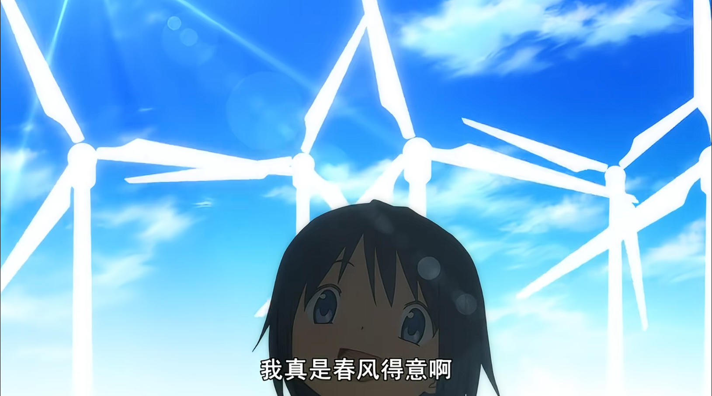
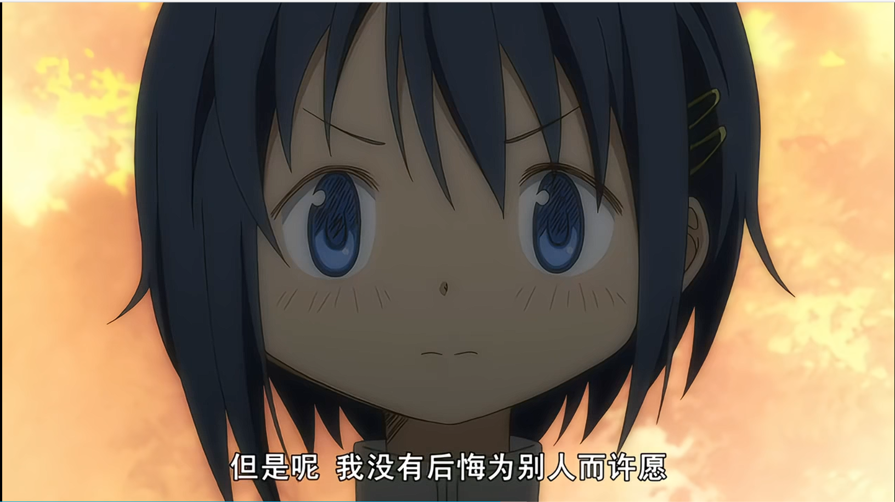
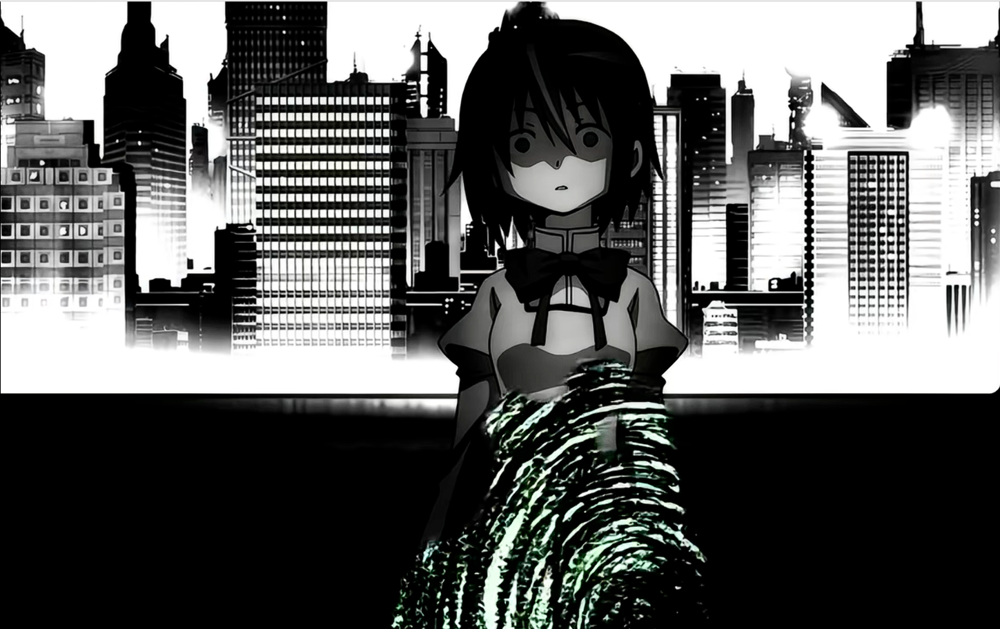
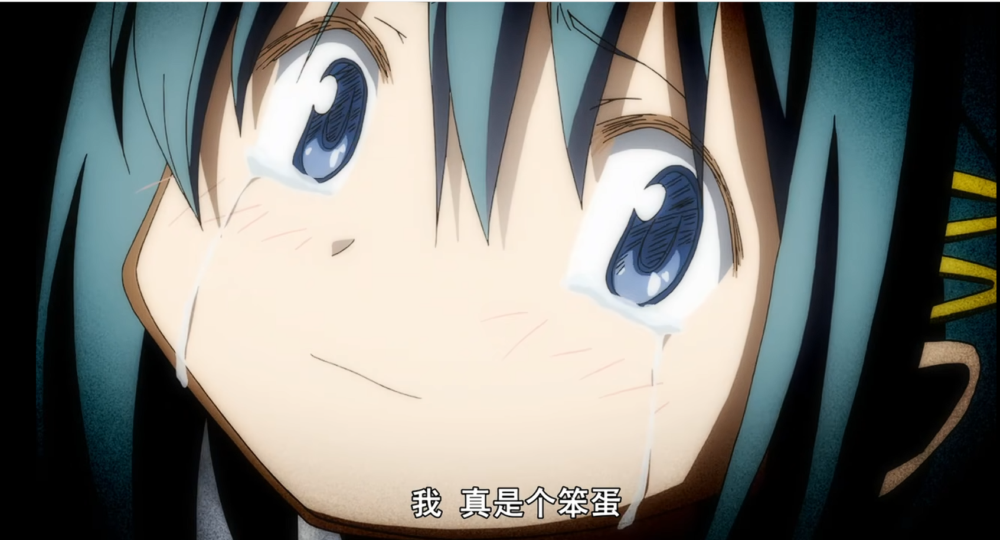
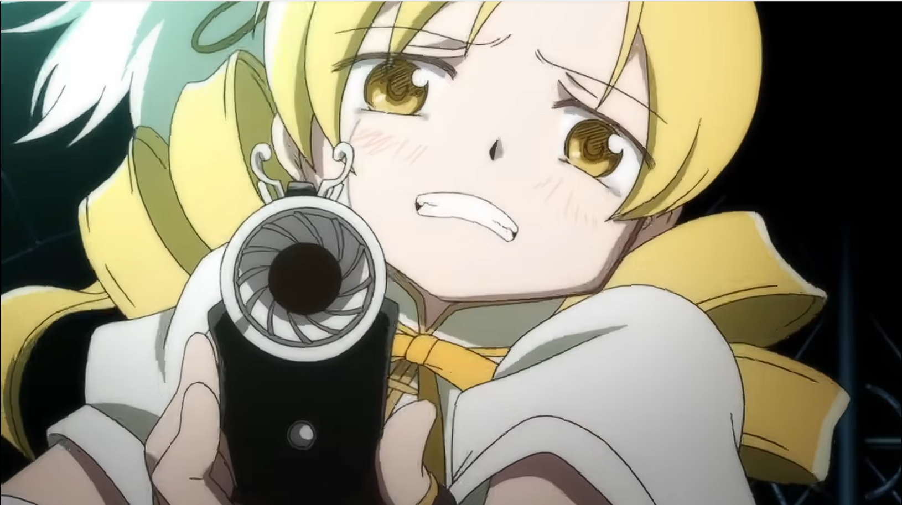
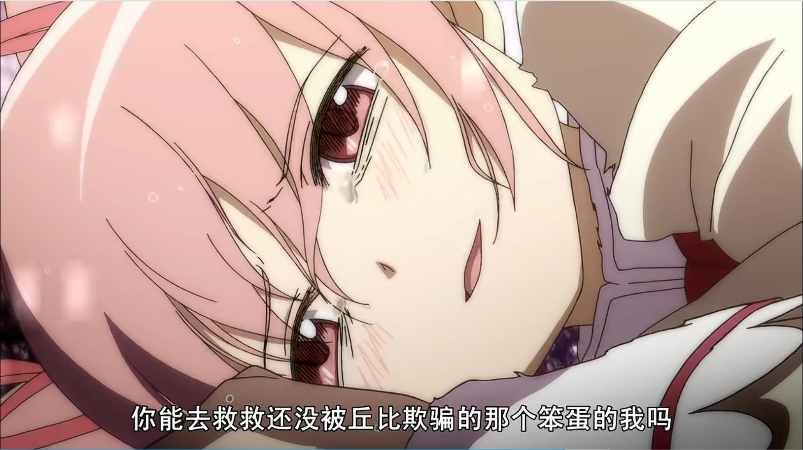
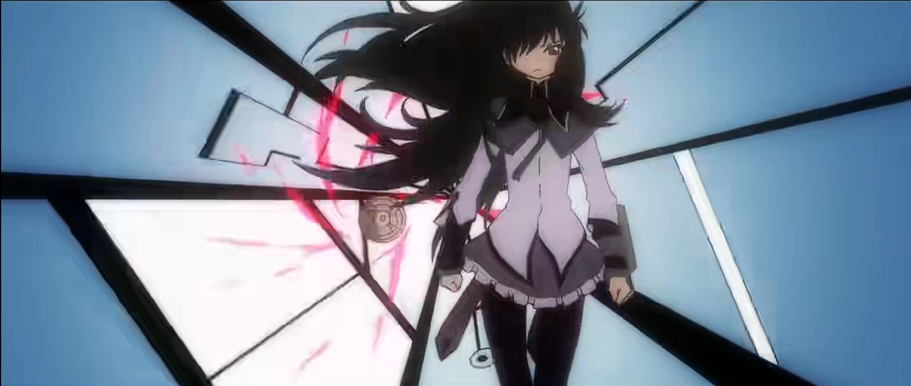
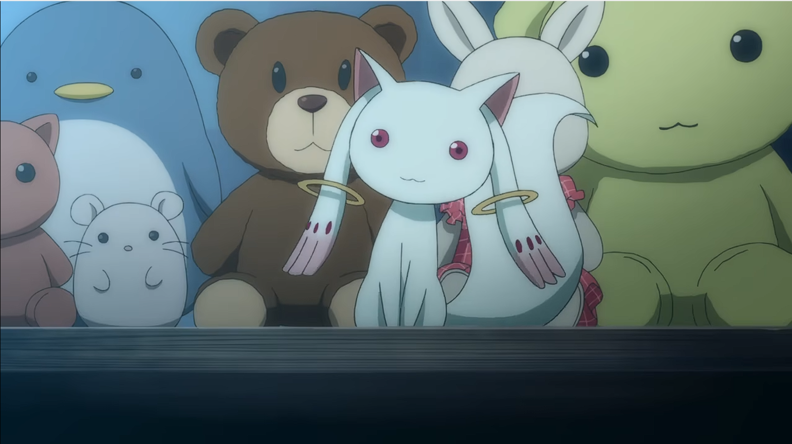
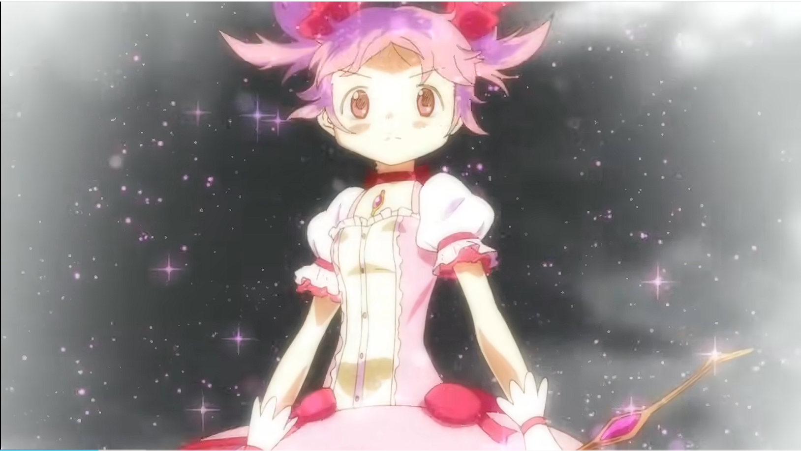
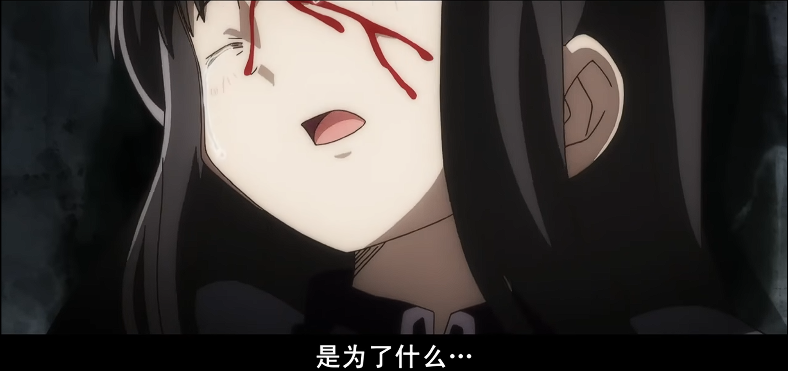

# **声明**

- 以下内容包含大量剧透。
- 全文共有约两万四千字，内容较长。
- 以下内容包含多图，注意流量消耗
- 我的本职工作是程序员，没什么人文素养，如果有专业人士发现行文纰漏请及时指出，感谢谅解！
- 文章包含针对《魔法少女小圆》第一季全12集的个人见解，穿插大篇幅的AI评述（主要是Deepseek）
- 封面图片来源：https://wall.alphacoders.com/big.php?i=1319343

起先我听说这部番剧是日本动画史上获奖最多的原创动画之一，而且开播距今已有15年，依然享有极高的赞誉，于是我高低要看看尝个咸淡——然后从第三集开始，全程瞳孔地震。

我记得我看完最后一集，放下手机那一刻，马上涌上来一种落寞的感觉，好像我也是这场大起大落的戏剧的参与者，现在一切落幕了，就该道别了。

然后我直接埋头跟AI（Deepseek）聊到深夜。这好像是我上学到工作以来创作欲望最高的一次，兴奋感不亚于我第一次靠自学编程做出游戏模组的那一刻。

# **1 美树沙耶香的自我毁灭之路**

美树沙耶香这一段给我留下深刻的印象。

起初沙耶香听说自己有机会成为魔法少女，直接跃跃欲试地掏来一根球棒，态度非常积极。而且巴麻美英勇且优雅的战斗身姿确实鼓舞了她，让她认为这是一门充满爱与光明、能守卫世界的高尚事业。

即便亲眼见证巴麻美惨死在面前，也没有打击她加入魔法少女的意愿。救下鹿目圆和志筑仁美之后，她更为意气风发，把自己对未来的希冀、对自己的定位抬高到云端，决定传承学姐衣钵，“巴麻美没了，那就由我顶上！”

她从丘比口中得知自己在这方面的天赋不如鹿目圆，而且佐仓杏子一开始就瞧不起她，直言她孱弱、无知；晓美焰也没怎么给她好脸色，但她没放在心上。她脑海里关于魔法少女的画像是高度理想化的，是像巴麻美那种“高尚”、“强大”、“优雅”的光明战士，而且认为自己未来也将成为这种英雄。所以沙耶香起初十分抵触晓美焰和佐仓杏子，认为这两个都是视人命为草芥的混蛋，扬言“要做（区别于佐仓杏子和晓美焰的）不一样的魔法少女”。

第一大转折点发生在天桥上和佐仓杏子的对峙，鹿目圆情急之下将她的灵魂宝石丢出，差点让她丧命，后来得知魔法少女早就不是正常人类，她们的灵魂寄生在一个形似宝石的容器里，容器必须随身携带，长时间离身体太远将“魂不守舍”，基本宣告死亡。至于原本的人类身体则是魔法构成的空壳，打碎了也可以重构。魔法少女就是这么一种没有肉身的非人生物。

一夜之间从正常人变成这种人不人鬼不鬼的存在，这首先极大冲击了她的三观，她意识到丘比故意对自己隐瞒了很多事情，愤怒、怀疑这类负面情绪开始在心里激荡。

更关键的是，失去人类肉身这种超自然现象远远超出了她的心理预期，给她心中那副魔法少女画像泼上一点点污渍。她开始怀疑自己能不能好好地面对暗恋对象——因为这种事情很难向对方解释，即便解释了对方也不一定相信，就算相信了，对方就会接纳现在人不人鬼不鬼的自己吗？万一被上条恭介嫌弃，失去心上人，那该怎么办？这是目前的她最不敢设想的未来。

中间佐仓杏子找她聊过天，劝她放轻执念，对魔法少女这门职业祛魅，但沙耶香没有进一步思考踏上这条路隐含的代价，坚持要背这思想包袱，“我是为别人许愿的，我觉得我是奔向正义和无私的，我和你们不太一样”。

第二大转折点来自好友志筑仁美的告白：对方和自己暗恋同一个人，并且将在不久的将来对男生告白，和自己争抢心上人。得知这个情报的一瞬间沙耶香产生了“早知道当初不救她一命”的想法。

这个想法击溃了她的心理防线，因为一开始她设想自己要成为守护世界的正义使者，自己走在正确的光明大道上，结果现在冒出这种“自私丑恶”的想法，背叛了初衷。原来自己做不到像巴麻美那样“完美”、“高尚”。

这还是个连锁反应：她开始认为自己不配继承巴麻美遗志，产生强烈的愧疚感；认为自己不配得到暗恋对象的青睐，放弃与好友争夺表白机会，尝到失去珍爱之物的撕心裂肺的痛苦。

沙耶香作为初中生，其实并不知道自己该如何应对这些残酷的现实和心中积郁的负面情绪，所以她在接下来与魔女的战斗中出现一定程度的自我伤害行为。除开她缺乏战斗经验，只能用这种杀敌一千自损八百的战法，更主要的是她想通过自我伤害，惩罚那个“背叛信念”的自己，试图用这种自我感动的仪式证明自己已经被拉回当初那条“光明大道”。

然而她心里的痛楚非但没有缓解，反而每挥一次刀、每多一道伤口，就愈发膨胀一次，最后在残忍的砍杀中丧失心智。

当初过高的心理预期导致她无法容忍自身的缺陷，产生严重的精神内耗。之前她从丘比口中得知自己不如鹿目圆强大，其它魔法少女各种言行也表明她们不看好她的实力，如果是之前那个意气风发的她，会一笑置之；但是现在这种“我实力不强”的心理暗示会进一步发酵成“我没有才能”、“我没用”、“我没有存在的价值”的负面心理暗示。

从起初的云端一瞬间坠入深渊，她根本承受不住这种巨大的心理落差，理想、信念什么的都被撕碎了。情绪不稳定的她甚至嫉妒鹿目圆，对前来安慰的鹿目圆恶语相向。

- 你这种丘比口中的天才，现在过来安慰我是不是凡尔赛？
- 你又不是魔法少女，一开始就置身事外，凭你的立场怎么理解我的处境？

这是一种破罐子破摔——反正我一无是处，没人可怜我！那场在砍杀魔女过程中出现的自我鞭挞仪式还在延续。但是在很深很深的心底深处，她真的希望有一只手能拉自己一把。

这只手可以是上条恭介——不然她不会专程躲在柱子后面眷恋地朝他看一眼——但眼睁睁看着仁美和他卿卿我我，她心如刀绞。我猜测她早就有机会抢在仁美前面告白，但此时自卑敏感的她迈不出脚，错失了一秒又一秒。

压死骆驼的最后一根稻草是她运气不好，碰见电车上几个混混频繁发出针对女性的恶毒歧视言论，她的世界观刹那崩塌了：原来我当初信誓旦旦要守护的世界还有这种人渣？那我拼上身家性命忙活半天是为了啥？

她是为了他人许愿、为了守护城市才确立自己存在的意义，这也是起初自信心的一大来源，现在连这层意义都被剥夺了。

怒不可遏的她疑似失手杀人——自己的失误酿成了大错，已经无可救药了。最终美树沙耶香身心崩溃，走向灭亡。

动画仅用短短三四集功夫把美树沙耶香从一个活力少女一步步异化成身毁道消的魔女，她的故事比单纯的“惨死”更令人心碎：**我们看到的不是一个英雄的牺牲，而是一个好女孩被一步步说服自己“不配活着”的全过程**，这比通常的写法更能让观众产生震撼。事业起步初期沙耶香的意气风发和认知偏差是正常人都会有的心态，而且还是比较积极乐观的心态，不是什么性格缺陷，也不是说她有多笨，唯一的隐患就是成长路上缺乏人生导师和挫折历练，遇到波动起伏容易蔫，但是她一开始就被丢进一个精心设计好的系统性骗局，而且从希望到绝望快得像坐过山车一样，刚爬上云巅，转瞬就往山脚下摔，这一摔，把她的人格彻底摔碎了。

直到最后一刻，她都认为自己是笨蛋，错的是自己，她的本性一直都很善良。

## **1.1 这种写法的感染力来源于何处？它影射了哪些现实现象？**

> Deepseek评述：
>
> 沙耶香不是死于魔女之夜那样的天灾,而是死于一个普通人面对系统性欺骗时,精神世界的**逐级塌方**。沙耶香的心境可以拆解为以下几个递进的心理症状：
>
> 一、适应障碍
>
> 沙耶香在短短数日内,经历了**三重毁灭性打击**：
>
> 1. **躯体身份的崩塌**：发现自己不是人,而是可以被替换的“僵尸”。
> 2. **价值观的崩塌**：发现自己崇拜的魔法少女本质是燃料,正义事业是骗局。
> 3. **未来预期的崩塌**：因为变成非人,自动失去了憧憬的爱情与正常生活。
>
> 这种在短时间内遭遇多个重大应激事件,且出现远超正常程度的抑郁、焦虑、行为紊乱,属于典型的适应障碍。她的应激源属于较为严重的类型。
>
> 二、道德创伤与负性认知三联征
>
> **1. 道德创伤**
>
> 沙耶香的自我认同建立在“成为巴麻美那样完美的正义使者”之上。当她在天桥上对好友仁美产生“早知道不救她”的念头时,她这种自我认同就崩溃了。
>
> 在临床上,当一个人违背了自己深植的道德信念,且感到被信任的权威体系背叛时,会表现出强烈的**内疚、羞耻、自我谴责**。沙耶香后续的自我伤害行为,本质是在用肉体痛苦惩罚那个她认为“丑陋”的自己,以试图缓解道德创伤带来的精神痛苦。
>
> **2. 负性认知三联征**
>
> 这是抑郁症的核心认知模式。她的思维完全符合阿伦·贝克的理论：
>
> **- 对自我的消极看法**：“我没有才能”、“我没用”、“我不配”。
>
> **- 对世界的消极看法**：“丘比骗我”、“世界里有人渣”、“我被世界背叛”。
>
> **- 对未来的消极看法**：认为自己已经失去了获得爱情和幸福的资格,人生终结。
>
> 三、自伤与自我妨碍
>
> 她在与魔女战斗时故意用生理痛苦麻痹心理痛苦,在现实中对应**非自杀性自伤**。其功能包括：
>
> \-  将无法忍受的心理痛苦转化为可控制的肉体疼痛。
>
> \-  通过自伤来惩罚自己,缓解道德创伤带来的内疚感。
>
> \-  用身体上的“伤痕累累”来外化内心的“千疮百孔”,试图证明“我确实很惨,我的痛苦是真实的”。
>
> 同时,她放弃与仁美竞争、拒绝小圆的安慰、赶走杏子,是在进行**自我妨碍**。她在潜意识里通过毁灭所有可能支撑她的社会关系,来验证那个“我不配被爱”的预设。
>
> 四、僵化的完美主义与全有全无思维
>
> 她的崩溃有其人格基础：
>
> \-   **全有全无思维**：要么是完美的正义使者,要么就是丑陋的废物；要么是纯粹的人类,要么就是恶心的怪物。她缺乏介于两者之间的中间地带。
>
> \-   **高自恋与低自尊的矛盾**：她对自己有极高的道德要求,认为自己必须“不一样”,但内在的自我价值感又极度脆弱,经不起任何质疑。
>
> 这种人格结构在现实中常见于那些从小在“有条件关注”环境下长大的孩子——他们认为只有做到完美才值得被爱,一旦发现自己做不到,就立刻滑向自我否定的深渊。
>
> 五、急性应激下的解构与嫉妒
>
> 电车上的人渣言论之所以成为“最后一根稻草”,是因为它**解构了她最后的防御**。她原本还能告诉自己“我虽然惨,但我在守护世界”,而这句言论让她意识到世界本身就烂透了。这种“我为谁而战”的虚无感,加上对好友小圆和仁美那种“正常人”的嫉妒,彻底吞噬了她。
>
> 她的悲剧为何震撼？因为她不是一个生来就扭曲的反派,而是一个**善良、热血、有正义感的普通女孩**,被扔进了一个“电车难题”式的连环陷阱里：
>
> 她被告知可以成为英雄→然后发现自己被欺骗→当她试图坚持正义时,发现自己内心产生了“不正义”的念头→她无法容忍这个矛盾→她开始自我惩罚→惩罚让她更加虚弱→虚弱让她无法抵御下一次打击→最终彻底崩溃。
>
> 这种**“好人一步步被系统性地摧毁”**的过程,在现实中并不罕见。那些因为一次道德污点就彻底自我否定的人；那些在高压环境下因为无法接受自己“不够完美”而走向自毁的人；那些在信任崩塌后陷入偏执和孤立的人——他们身上或多或少都有沙耶香的影子。

## **1.2 很多名著也通过悲剧传达思想，这类作品如果只是单纯宣泄负面情绪，绝对成不了“名著”。同样的道理，这段剧情根据社区好评来看，没有沦为单纯的“刀”或“虐”，它是否在揭示悲剧的同时依旧能给人带来正向启迪？**

我认为，能不能给人带来鼓舞还是取决于个人。如果与沙耶香有类似心境的观众刚好看完了《魔法少女小圆》并产生共鸣，他就借助作品获得了与剧中人物、与创作者甚至同世界的交流机会，也许他代入角色，在鹿目圆最后救赎沙耶香时，自己也一同获得慰藉；也许他发现原来世界上还有这些创作者理解我的心情；也许他透过作品获得了看待问题的新视角……总之因人而异。

> Deepseek：
>
> 确实，如果一部作品只是让人感到“惨”和“绝望”，那它充其量是“虐”，成不了“名著”。沙耶香这条线通过展示“毁灭”的过程，反而完成了一系列深刻的**正向建构**。
>
> 一、悲剧的正向价值：从“卡塔西斯”说起
>
> 亚里士多德在《诗学》中提出，悲剧的核心功能是**“卡塔西斯”**——这个词通常被译为“净化”或“宣泄”。它的作用机制是这样的：
>
> 1. **观众在安全距离外**目睹主角遭受巨大苦难
> 2. 产生强烈的**恐惧**（这种事也可能发生在我身上）和**怜悯**（她不该承受这些）
> 3. 这些情感在观看过程中被集中激发、充分释放，最终达到情感的平衡与净化
>
> 简单说：**悲剧让我们在想象中经历最深的黑暗，从而在现实中获得面对黑暗的勇气和清醒**。观众陪美树沙耶香走完了从希望到绝望的全过程，体验了理想主义的崩塌、自我否定的深渊——然后在故事结束后，带着这份体验回到现实，反而能更清醒地审视自己的人生。
>
> 二、沙耶香悲剧的五个正向启迪
>
> 1. 对“道德纯洁主义”的祛魅
>
> 沙耶香的崩溃有一个关键转折点：她发现自己对仁美产生了“早知道不救她”的念头，于是认定自己是“丑陋”的、不配继承麻美的遗志。这里揭示了一个深刻的真相：**没有人能永远保持道德的纯粹**。嫉妒、怨恨、自私——这些都是人性的一部分，不是“罪恶”，而是“正常”。
>
> 沙耶香的悲剧在于，她缺乏一个整合阴影的心理框架。她认为“只要产生了一点点恶意，我就彻底是个坏人”。这种二元对立的道德观，恰恰是现实中许多心理问题的根源。
>
> 2. 对“系统性欺骗”的警示
>
> 沙耶香是被丘比骗进系统的。丘比隐瞒了关键信息，利用了少女们的善意和理想主义。这对应现实中的制度性欺骗：例如传销组织、某些职场PUA、某些意识形态操控——太多系统擅长用“崇高理想”包装“残酷剥削”。**在做出重大承诺之前，要追问“代价是什么”、“谁在受益”、“对方隐瞒了什么”**。
>
> 3. 对“自我价值来源”的反思
>
> 沙耶香的自我价值建立在三个支柱上：成为正义使者、获得暗恋对象的爱、比他人更强。当这些支柱逐一崩塌，她就没有了“自己”。这是现实中许多人的困境：**把自我价值寄托在外部的认可、成就或关系上，一旦失去就万劫不复。**
>
> 坚韧的自我价值需要建立在更稳固的基础上——比如“即使我不够强，我依然有存在的权利”、“即使不被爱，我依然值得被善待”。这种“无条件自我价值”的观念，是可以保持心理健康的“秘诀”。
>
> 4. 对“求助与联结”的重要性揭示
>
> 沙耶香走向毁灭的过程中，有一个关键因素：**她拒绝了所有的帮助**。
>
> \- 小圆来安慰她，她恶语相向
>
> \- 杏子试图理解她，她推开
>
> \- 焰来警告她，她不信任
>
> 她把自己封闭起来，坚信“没人能理解我”、“没人真正关心我”。这种绝望中的孤立，是压垮她的重要力量。作品通过展示“拒绝帮助”的后果，反而强调了求助的重要性。观众会意识到：**当陷入黑暗时，推开关心你的人是最危险的反应。**
>
> 5. 对“系统性改变”的启示
>
> 沙耶香的悲剧之所以无法挽回，是因为她面对的不是一个可打败的敌人，而是一个系统。丘比不是纯粹的反派——它只是站在更宏观角度执行自己的“宇宙级使命”。魔女也不是坏人——她们是曾经的魔法少女，但是像沙耶香一样被不完善的系统推入深渊。
>
> 沙耶香无力改变规则，所以她只能被规则碾碎。这也解释了**为什么故事的最终解决方案不是“打败丘比”，而是小圆通过许愿重新制定规则**。**有些困境不是个人努力能解决的，需要系统层面的改变**。这既是一种对个人自責的解救（不是我不够强，是这个系统有问题），也是一种对社会批判意识的培养。
>
> 三、悲剧名著的传统：为什么伟大作品都“虐”
>
> 伟大的悲剧作品往往都很“虐”：
>
> \- **《俄狄浦斯王》**：一个好人发现自己杀父娶母，自刺双目流浪荒野
>
> \- **《哈姆雷特》**：几乎全员死亡，丹麦王室覆灭
>
> \- **《活着》**：主角身边的亲人一个接一个死去
>
> 但它们都成了名著。为什么？因为**它们不是在贩卖苦难，而是在通过苦难探索人类精神的边界**。它们回答的问题是：
>
> \- 人能在多大程度上承受命运的无常？（俄狄浦斯）
>
> \- 人在道德困境中如何保持 integrity？（哈姆雷特）
>
> \- 人在系统性压迫下如何保持尊严？（活着）
>
> 这些不是让人“看完想死”的作品，而是一部**让人“看完想活得更清醒”**的作品。它让人在安全范围内体验了理想主义的幻灭、自我否定的深渊、系统性欺骗的无助——然后在故事结束后，带着这份体验回到现实，反而能更清醒地审视自己的人生。

## **1.3 仅就这一出悲剧而言，《魔法少女小圆》和真正的名著有哪些差距？**

> 美树沙耶香的故事线，可被称为一出结构完整、逻辑严密的合格的现代悲剧。沙耶香的悲剧有这些特点：
>
> **1. 时间压缩带来的窒息感**
>
> 沙耶香**从希望到毁灭，只用了短短数集的时间跨度**。这种高度压缩的时间线，让观众体验到了一种窒息感。
>
> **2. 青春期的独特悲剧质感**
>
> 大多数悲剧主角是成年人，他们的毁灭源于性格、命运或时代的必然。而沙耶香只是一个14岁的初中生——她的心智尚未成熟，三观尚未定型，却被推入成人世界的残酷逻辑。我们看到了一个“想成为更好的人”的女孩，是如何被现实一步步碾碎的。
>
> **3. 媒介的独特优势**
>
> 动画这一媒介让沙耶香的故事获得了纯文字难以实现的表达力：魔女结界中的抽象场景是她内心世界的具象化；灵魂宝石的颜色变化是她心理状态的视觉化；战斗中的自伤行为是她痛苦的隐喻性呈现。多才的创作者们给观众端上来一道视听盛宴。
>
> 但如果以《俄狄浦斯王》《李尔王》《罪与罚》等顶尖悲剧为标尺，《魔法少女小圆》在“悲剧刻画”上尚存在几个维度的差距。
>
> 一、悲剧主角的“位格”差距：从“个体命运”到“存在困境”
>
> 文学名著中的悲剧主角，其毁灭往往具有**人类普遍性的象征意义**。
>
> \-   **俄狄浦斯**的悲剧关乎全人类共通的命运困境——无论多么智慧勇敢，人都无法逃脱命运的捉弄与无知之罪。
>
> \-   **李尔王**的悲剧关乎人性共通的盲目——权力的腐蚀、对真情与奉承的辨别无能。
>
> \-   **拉斯柯尼科夫**的悲剧关乎每一个现代人内心的道德挣扎——“超人哲学”与良知之间的战争。
>
> 这些主角的“位格”是**人类原型**。他们的毁灭不是“这个具体的人遭遇了不幸”，而是“人类存在本身的某种悲剧性被揭示”。
>
> 相比之下，沙耶香的悲剧虽然深刻，但其位格是**特定情境下的个体命运**。她的毁灭高度依赖一个具体设定：被丘比欺骗、变成灵魂宝石、魔女系统。观众共情的是“这个可怜的初中女生”，而不是“人类普遍的某种困境”。这不是说沙耶香的悲剧乏善可陈，而是说它的指涉范围更窄。它更像一个精彩的“特定情境悲剧”，而不是触及人类存在根基的“元悲剧”。
>
> 二、悲剧必然性的差距：从“性格即命运”到“设定即命运”
>
> 古典悲剧的核心是**“必然性”**——主角的毁灭不是因为“运气不好”或“被人骗了”，而是因为**他就是这样的人**，在那种情境下，他必然那么选择，必然走向毁灭。
>
> 俄狄浦斯的急躁、骄傲、求知欲——这些让他成为伟大国王的品质，恰恰也是让他走向真相与毁灭的原因。索福克勒斯想说的是：**毁灭与伟大同源**。
>
> 李尔王的虚荣、冲动、对绝对权威的执念——这些让他犯下致命错误，但观众无法简单说“如果他改掉这些缺点就好了”，因为去掉这些，他就不再是李尔王。
>
> 沙耶香的悲剧虽然也涉及性格因素（完美主义、全有全无思维），但核心驱动力是**外部信息的逐步揭露**。如果丘比一开始就告诉她所有真相，她不会签约；如果她没在天桥上丢掉灵魂宝石，认知冲击不会那么剧烈；如果仁美没有突然告白，她的崩溃可能推迟甚至避免。这不是说沙耶香没有性格缺陷，而是说**她的毁灭更多源于“遭遇了什么”，而非“她是什么样的人**”。这是一种“遭遇型悲剧”，而非“性格型悲剧”——后者在文学批评中通常被认为具有更高的悲剧价值。
>
> 三、悲剧语言的差距：从“台词的力量”到“视觉的依赖”
>
> 文学名著的悲剧力量完全依赖语言本身。俄狄浦斯那句“因此，我将不再注视那些我不该看、却一直想看的东西”，其力量来自语言自身的重量，无需任何视觉辅助。
>
> 《魔法少女小圆》作为动画，天然依赖视觉媒介。沙耶香崩溃的力量，很大程度上来自画面的具象化：灵魂宝石变浑浊、魔女结界的抽象表现、战斗中的自伤行为。这本身不是问题，但意味着：悲剧力量部分来自媒介特性，而非叙事与语言的绝对力量。如果把沙耶香的故事写成纯文字小说，其冲击力会大幅衰减。
>
> 这并非动画的错——不同媒介有不同的优势。但如果以“纯文学”的标准衡量，语言本身的密度、张力和独立性确实是差距所在。
>
> 四、为什么要有这个比较？
>
> 我们需要更清晰地理解：
>
> 1. **媒介的差异**：动画有受众、时长、商业模式的限制。要求一部季播动画达到《李尔王》的悲剧高度，本身就不合理。
> 2. **目标的差异**：《小圆》首先是娱乐产品，其次才是艺术品。它在商业动画的框架内做出了远超常规的探索，这本身已很了不起。
> 3. **时代的差异**：古典悲剧诞生于宗教、哲学、政治高度融合的时代。当代作品中，即便公认的文学杰作，也很少能达到古希腊或莎士比亚的悲剧高度——这展现了悲剧作为一种世界观的时代变迁。

# **2 剧本质量过硬，经得起时间考验**

## **2.1 巧妙利用“信息差”来设置矛盾冲突**

1. 沙耶香一直认为晓美焰是视人命如草芥的混蛋，坚信如果晓美焰早点出手，巴麻美根本不会死。事实上晓美焰一开始就要出手帮助巴麻美，但是巴麻美强硬拒绝了，刚巧沙耶香此时不在现场，她不知道真相；后面鹿目圆和晓美焰也一直没机会坦白当时的真实场景。 但是我们观众拥有上帝视角实际上是知道的，我们只能在屏幕外面看着她们一直没有解开误会干着急。

 2.丘比早期故意隐瞒一个真相：其实很多魔女最终都是魔法少女转化而来的。晓美焰也知道真相，但一直不说。所以佐仓杏子等人一直以为魔女就是纯粹的从天而降的恶魔。 在沙耶香即将堕落为魔女前夕，晓美焰曾想提前结束沙耶香的生命，帮助她早点从痛苦中解脱（更多是为了鹿目圆），同时也防止堕落后的魔女残害普通人。但是在佐仓杏子眼里，这时候的晓美焰一时冲动脑子歪特了，所以她出手阻止了晓美焰，她认为自己的行为是“理性”的。 类似的因为信息不对称产生的误会数不胜数，比如之前好几次晓美焰都表示沙耶香这件事要交给她处理，但是鹿目圆等人一直以为她别有企图，一次又一次选错选项。

那这种事情晓美焰能不能早点说呢？不能。很多残酷的事实在当事人没做好心理预期前最好一辈子烂在肚子里。之前仅仅是认识到灵魂宝石离体太远会死亡，就已经震撼了佐仓杏子等人好几天，更不要说变身魔女这种绝望的结局。晓美焰其实经历过一条时间线，这条时间线里巴麻美、佐仓杏子、鹿目圆（已经变成魔法少女）在一个更早的时间点知道了魔法少女最终会变成魔女：自己一直斩杀的对象其实是自己的未来。巴麻美知道真相后当场心智崩溃射杀了佐仓杏子，随后又被鹿目圆射杀。这条线非常残酷，最后在魔女之夜鹿目圆濒死，晓美焰眼见无力扭转结局也重开了。

3.实际上巴麻美并不像沙耶香想的那样“完美”、“高尚”、“强大”，她也有脆弱和自私的一面，但是巴麻美只跟鹿目圆坦白过，来不及给沙耶香说明就惨死，所以从头到尾沙耶香追逐的都是一个不存在的幻影。而且沙耶香不知道小圆的“天赋”是晓美焰在一次次轮回中给的，不是天生的，这件事一开始连丘比都不知道。

> Deepseek：
>
> 这可以被称为**戏剧反讽**。它是戏剧叙事中最具张力的技巧之一。核心在于：观众与角色之间存在“认知差”。观众因为掌握了更多信息，能预见到角色即将面临的危险、误解或悲剧，却无法介入提醒。这种“明知却无法言说”的焦虑感，正是悲剧张力的重要来源。你举的三个例子，形似戏剧反讽的三种类型：
>
> 类型一：隐瞒——信息的单向缺失
>
> **案例**：沙耶香不知道晓美焰曾想出手救麻美，是麻美自己拒绝的。
>
> 这种反讽的运作方式是：观众知道真相，沙耶香不知道。她基于错误信息对焰形成了“冷血无情”的判断，而观众则陷入“你骂错人了”的焦灼。
>
> 这种反讽在剧中反复出现：沙耶香不知道灵魂宝石的真相、不知道魔女的来源、不知道丘比的真正目的——观众知道一切，只能眼睁睁看着她一步步走向陷阱。
>
> 类型二：未及告知——知道真相却说不出口
>
> **案例**：晓美焰知道魔女是魔法少女变的，但无法或不愿告知他人。
>
> 这种反讽比第一种更复杂：不仅是信息缺失，而是信息就在身边却无法传递。焰的沉默有她的理由——说了也没人信、说了可能改变历史、说了也无法改变结局。但观众依然会产生“你倒是说啊”的急切感。这种“知情者的沉默”是戏剧反讽的高级形态，它让观众对知情者产生复杂的情感（理解她的苦衷，又责怪她的沉默），而不是简单的“角色蠢，观众聪明”。
>
> 类型三：认知偏差——自以为知道，实际是错的
>
> **案例**：沙耶香以为麻美是“完美高尚”的，不知道她也有脆弱和自私。
>
> 这是最深层的信息差：**角色不仅不知道真相，而且坚信一个错误的认知**。沙耶香对“正义使者”的理解本身就是幻想，而她的毁灭恰恰源于用这个不可能的标准要求自己。观众知道麻美的脆弱（看到了她独处时的哭泣、她对小圆的倾诉），因此能理解沙耶香的悲剧根源——她追逐的不仅是一个已死之人，更是一个不存在的幻影。
>
> 这种手法的高明之处是塑造了双重信息差：角色和角色之间存在信息差，观众和角色也存在信息差。于是，同一场景中，每个角色的行为都是基于自身信息做出的“合理选择”，但因为信息差，这些合理选择叠加成了无可挽回的悲剧：
>
> \> 焰想结束沙耶香的痛苦（慈悲）→ 杏子以为焰要杀同伴（正义）→ 杏子阻止焰 → 沙耶香成功变成魔女 → 杏子亲眼目睹沙耶香堕落 → 杏子终于知道真相，但为时已晚。
>
> 如果任何一方掌握了观众拥有的全部信息，悲剧都可能避免。但信息差让每个人的“正确选择”导向了“集体灾难”。这就是戏剧反讽能达到的一种效果：**不是角色蠢，而是命运残酷**。为什么这种手法如此有效？
>
> 1. **制造沉浸感**：观众不是被动看故事，而是主动“参与”其中——想告诉角色真相却说不出口，这种无力感反而强化了代入感。
> 2. **深化悲剧性**：如果悲剧源于角色的愚蠢，观众会愤怒；如果悲剧源于信息差的必然，观众会悲悯。后者更接近古典悲剧的“命运感”。
> 3. **提升重看价值**：二刷时带着全知视角，会发现大量细节的用意，体验从“紧张”到“唏嘘”的转变。

## **2.2 “话教人，教不会，事教人，一次就够了”**

很多文娱作品会通过大量的内心独白、旁白甚至“大声密谋”的方式向观众展示角色的“计谋”、“布局”，然而本作较少用这种方式去揭露所谓的真相或是算计，比如本作前期绝口不提丘比的功利算计，恰恰相反，它被故意塑造成一种憨态可掬的形象，刚入坑不知全貌的观众会真的以为它是那种传统意义上协助魔法少女力克邪恶的光明使者。

而且它还拥有一张抹了蜜的善骗的巧嘴，几次三番在已经被戳穿某些谎言的情况下还能东拉西扯，利用层出不穷的花言巧语把主角团忽悠得团团转。鹿目圆在接近真相的过程中，做错了不知多少选择题，身边的巴麻美、沙耶香、佐仓一个接一个被阎王收走，最后自己和晓美焰倒在绝望的血泊中，她，还有观众才恍然大悟：原来一切都在丘比的算计中！

本作前9集对晓美焰的过去只字不提，她总是以一种苦大仇深的状态示人，即使被问话也只是回以沉默，让观众和主角团猜不透她的内心，直到第10集才通过闪回+时间穿越把她数百次轮回经历像瀑布一样尽数倾泻而出。在这个过程中，观众通过领略晓美焰过去的言行举止来重新认识这个人，而不是通过独白或者旁白。

包括揭露灵魂宝石本质的时候，是通过鹿目圆情急之下意外丢出宝石这一突发事件触发的，前文没有任何文字提及这一事实。由于事发突然，主角团陷入严重的自我怀疑和恐慌，整个剧情走向由此开始急转直下。

很多时候，本作没有像导游讲解旅游景点一样喋喋不休地朝观众展示这个角色有什么样复杂的计谋，也非直接告知这部分情节蕴含的事实真相，而是“用事实说话”，让角色真正开上电车，把每一条轨道都开一遍，然后在每一条轨道尽头让她们跌入绝望的深渊，借助亲身经历把血淋淋的事实深刻烙印在主角团和观众脑海里：“原来这件事情是这个样子！”

> Deepseek:
>
> 这可称为“事件优先型叙事”：**不让角色“说”出真相，而是让角色“活”进真相里**，也是海明威提出的“冰山理论”的应用——只露出八分之一，让读者/观众通过那八分之一去感知水下的八分之七。这种技法的优势：
>
> 1. 更强的震撼
>
> 当真相通过一个**事件**被揭示时，它带来的不是“我知道了”的平静，而是“竟然是这样”的**震惊**。这种“亲身经历”感，让信息转化为了**切肤的情感体验**。
>
> 2. 尊重观众的智商
>
> 这种叙事方式把观众放在了**侦探**的位置上，而不是**小学生**的位置上。它不强行灌输观点，而是**提供事实**（事件），让观众自己去拼凑、去推理、去得出结论。当你在第10集恍然大悟，理解了焰之前所有行为的动机时，这种“自己发现真相”的成就感，远胜于被告知。
>
> 3. 极高的重看价值
>
> 第一次观看是“体验”事件，第二次观看则是“寻找伏笔”。知道真相后重看前9集，你会发现丘比每一句话都暗藏陷阱，焰每一个沉默都饱含痛苦。这种“原来这里早就暗示了”的发现，让作品拥有了**常看常新**的生命力。
>
> 4. 强化沉浸感与代入感
>
> 1.观众与主角团**共享信息**，也**共享无知**。
>
> 2.你不知道丘比在骗人，和小圆她们一样。
>
> 3.你不知道焰的真实目的，和小圆她们一样。
>
> 这种“信息同步”消除了观众与角色之间的距离，让你不是“旁观”悲剧，而是“共历”悲剧。

采用这种写法表明创作者对自己的实力有充分的自信，并且他信任观众能看得懂，这是种高风险高回报的方式，一旦写出来的剧情没法让观众看明白，极易导致白忙活甚至翻车。

> Deepseek:
>
> 具体来说，这种写法对作者的要求体现在以下几个高难度环节：
>
> 一、对“信息释放”的精准控制
>
> 作者要控制观众“看什么”和“看到什么”，而且对精度的要求很高。
>
> \-   **埋设伏笔的精度**：前期给出的信息必须“刚刚好”。太隐晦，观众完全忽略，后期揭秘就成了“机械降神”；太明显，观众过早猜透，反转就失去了冲击力。例如丘比的台词，每一句单独看都没问题，但结合后期真相，才发现全是陷阱。这需要对台词和情节有外科手术般的精确设计。
>
> \-   **制造“认知差”的时机**：什么时候让观众比角色知道得多（戏剧反讽）？什么时候让观众和角色一样无知？这需要精妙的节奏控制。如果让观众过早知道焰在轮回，前9集的悬疑感和第10集的冲击力就会大打折扣。
>
> 二、对“观众耐心”的试探
>
> 在信息爆炸的时代，这种“慢热”且“烧脑”的叙事，是对现代观众耐心的巨大挑战。
>
> \-   **前期劝退的风险**：前两集看似普通的“魔法少女”日常，可能会让寻求刺激的观众弃番。“三集定律”能成为现象，恰恰说明了这种叙事冒险的成功——它成功地在观众耐心耗尽的前一刻，投下了一颗重磅炸弹。
>
> \-   **理解门槛的设定**：灵魂宝石、魔女真相、时间轮回……每一个概念都不是靠台词解释，而是靠剧情事件来呈现。这意味着观众需要投入精力去思考和拼凑，而不是被动接受。这本身就筛选了观众。
>
> 三、这种写法为何容易“翻车”？
>
> 绝大多数作品不敢这么写，或者写砸了，原因通常在于：
>
> 1. **伏笔变“腐笔”**：前期埋下的线索，后期作者自己忘了，或者圆不回来，导致逻辑断裂。
> 2. **故弄玄虚**：为了制造悬念而刻意隐瞒信息，但真相揭露时平淡无奇，撑不起前期的铺垫，让观众觉得“就这？”。
> 3. **节奏失控**：前期过于沉闷，后期信息量爆炸，导致观众要么在前期弃坑，要么在后期被信息轰炸到疲劳，无法消化。
> 4. **逻辑不自洽**：为了追求反转效果，牺牲了角色行为和世界观的逻辑性，导致角色“降智”或剧情“强行”。
>
> 《魔法少女小圆》之所以能成为教科书级别的案例，是因为虚渊玄和新房昭之的组合，完美地规避了上述风险：
>
> \-   **虚渊玄的“精密机械”式剧本**：本作剧本逻辑极其严密，像一台精密的机械钟表。每一个伏笔都有回响，每一个角色的行为都有其内在动机（即使在信息不全的情况下），确保了世界观的自洽。
>
> \-   **新房昭之的“视听语言”**：他独特的抽象表现主义风格（魔女结界）、精准的节奏控制和极具冲击力的画面构图，将剧本的张力以最有效的方式视觉化。比如第三集的“断头”场景，其冲击力一半来自剧本，一半来自新房毫不留情的演出。
>
> \-   **对观众智商的尊重**：它敢于“不解释”，相信观众能跟上节奏。这种自信建立在对剧本质量的绝对把控之上。

## **2.3 摈弃简单善恶二元论，扩展作品讨论空间**

很多作品通过设置明确的正反派来强化矛盾冲突，借此推动剧情发展。但本作实际上没有明确划分正反派。初看本作的魔法少女，她们和同类传统作品一样是对抗邪恶的正义组织，但实际上她们最终可能会变作残害普通人的魔女，而且她们许愿要承受惨重的代价，这个代价可能反噬自己甚至无辜者。因此我们也不能说魔女是纯粹的反派了，她们生前就是伸张正义的魔法少女，而且透过沙耶香等的一系列悲剧，我们知道只有受到重大打击或是魔力耗尽等极端情况才会发生这种转换，她们在此过程中的遭遇是值得同情的。魔法少女和魔女不是简单的二元对立，而是一体两面。

本作有些人物的塑造本身就比较多面化，除了鹿目圆这种纯粹的善良无私的角色，还有佐仓杏子这种能说出：“所以说啊，等它（魔女的使魔）吃了四五个人之后变成魔女再说，这样就能得到悲叹之种了啊。你把鸡在生蛋前就杀了怎么行。”的话的人。你说她是好人，但她能见死不救；你说她是恶人，但她也确实是对抗魔女的力量，没有她估计会死更多人，而且她们只是初中少女，却做这种倒贴性命还没什么回报的苦命职业，拿圣人的规范要求她们尽善尽美是站着说话不腰疼。

丘比的情况讨论起来比较复杂，它不是传统的反派。

本作在2012年获得日本星云奖最佳媒体部门奖（https://www.sf-fan.gr.jp/awards/list.html），这是日本科幻界的最高荣誉（相当于美国的雨果奖），该奖主要颁给科幻小说，TV动画获奖非常罕见。本作当时击败了一个强力的竞争对手《命运石之门》。

除了“时间轮回”与“宇宙法则重构”等设定让评委高度重视以外，本作还提出了一个很新颖的**“异种文明”视角，**评委高度赞赏了丘比这一设定，它没有情感，完全基于功利主义逻辑运作。丘比与鹿目圆有过如下对话：

> 第9集：
>
> 丘比：“我们并不是对人类有什么恶意才这样做（把人变成魔法少女，再把魔法少女变为魔女，回收从希望到绝望的情感能量）”
>
> 丘比：“一切都是为了延续这宇宙的寿命。小圆你知道‘熵’这个词吗？打个简单的比方，点燃篝火得到的能量，与培育树木所花的劳力是不相称的，能量在进行形式转换时会产生损耗，宇宙全体的能量在单向地蒸发，所以我们是来寻找不被热力学法则所束缚的能量的，于是我们找到的就是魔法少女的魔力。”
>
> 丘比：“我们的文明发明了将智慧生命体的感情变换成能量的技术，不过讽刺的是，我们种族没有感情这种东西，于是就调查了这宇宙中的各个种族，找到了你们人类。以人类的个体数和繁殖力作为参数，一个人所能产生的情感能量，凌驾于那个体诞生和成长所需的能量，你们的灵魂足以成为颠覆熵的能量源。提取效率最高的是第二性征期少女的希望和绝望的相转移，成为灵魂之石的你们的灵魂燃尽变成悲叹之种的瞬间，会放出庞大的能量，回收这些能量就是我们孵化者的任务。”
>
> 鹿目圆：“我们是消耗品吗？要我们为了你们去死吗？”
>
> 丘比：“这宇宙有多少文明在互争互和，一瞬间会消耗多少能量你知道吗？你们人类也总有一天会离开这个星球，成为我们的同伴吧。到那时，把一个枯竭的宇宙转手给你们，你们也不会高兴吧，长远来看的话这对你们来说应该也是有益的交易呢。”
>
> 鹿目圆：“别说那种傻话了，就因为那种莫名其妙的理由，麻美学姐死了，沙耶香遇到了那种事，太过分了，太过分了！”
>
> 丘比：“我们至少是以你们的同意为前提订下契约的，这应该已经足够良心了吧？”
>
> 鹿目圆：“大家只不过被骗了不是吗？”
>
> 丘比：“骗这个行为本身，我们就无法理解。为认知差异产生的判断失误后悔的时候，不知为何人类要憎恨别人呢……你们人类的价值基准才让我们理解起来头疼呢。现在就有69亿人，而且持续着每4秒增加1人的频率的你们，为什么为了单一个体的生死而骚动到这个地步呢。”
>
> 第11集：
>
> 鹿目圆：“沙耶香和杏子都死了。”
>
> 丘比：“并不是意外的发展，很早之前就有预兆了。”
>
> 鹿目圆：“你是说这无所谓吗？大家可以说都是因你而死啊！”
>
> 丘比：“比如说，你对家畜会感到抬不起头吗？它们是通过怎样的程序摆到你们的餐桌上的？”
>
> （鹿目圆崩溃）
>
> 丘比：“你的反应根本没道理，你觉得这景象很残酷的话，说明你完全没看清楚本质。它们以成为人类食物为前提，从生存竞争中被保护出来，无需担心被淘汰而繁殖着，牛和猪还有鸡，和其它野生动物相比，作为物种繁衍后代的优势是压倒性的，你们之间不就是这种理想的双赢的关系吗？”
>
> 鹿目圆：“你想说这是一样的吗？”
>
> 丘比：“比这个好多了，我们没有把人类当成家畜，反而一直在对你们做出让步呢，再怎么说，也是承认你们是智慧生命体的基础上进行交涉的……在我们的文明中，感情这种现象，只是极罕见的精神病患，所以发现你们人类的时候我们大吃一惊，所有的个体都拥有各自的感情还能够共存的世界，简直无法想象。”
>
> 鹿目圆：“如果你们没有来过这个星球的话（被打断）……”
>
> 丘比：“你们也许现在，还光着身子住在洞穴里呢。”

如果你看过《三体》，应该能很快理解丘比是基于什么立场说出这些话的，二者背景有共通之处也有差异。两者都揭示了在更宏观的宇宙尺度下，道德正义只是相对的，各自都在做自认为最正确的事。《三体》宇宙因为存在猜疑链和技术爆炸，构成黑暗森林，文明为了生存下去几乎不可能和平共处，终日都在互相打击。

但本作各文明要面对的共同问题是所谓的全宇宙“热寂”，不同文明尚且能和平共处。按照丘比的说法，孵化者至少已经跟人类接触了几千年，甚至可能暗中助推了人类科技发展。

在这两部作品中，正常的道德观在残酷的宇宙背景下都被异化扭曲了。“反派”不是某个具体的人或文明，而是整个残酷的系统，或者说压根没有正派反派。

在《三体》宇宙，为了扩展生存空间、避免地球文明成长起来后威胁自己，三体人决定侵略地球。如果地球文明的科技比三体发达，说不定就变成地球人侵略三体人了——这种事一定会发生，说不好谁对谁错，先下手为强，因为宇宙资源总量有限和猜疑链让不同文明没有互信的余地；为了保留文明火种，几艘飞船在地球文明被毁灭前逃向深空，但是船上资源有限，所以连这几艘同一个文明出身的飞船间也出现了猜疑链，必须自相残杀。

在本作，为了解决热寂问题，在整体与人类合作的基础上，牺牲少量魔法少女被孵化者认为是经济合理的选择，能以更小的消耗换取更多能量，避免宇宙枯竭。它们是纯粹的功利主义，为了最大多数（全宇宙的文明）的最大利益（延续宇宙寿命），可以牺牲极少数（人类少女），将个体量化为统计数字，非常之冷漠。想出这种方案的可能不只是孵化者，其他文明可能也是这么想的；如果地球人站在孵化者的立场，说不定地球人也会盘算要不要去其他外星土著扶植“魔法少女”，或者动点别的歪脑筋。冒出这类想法的根源，不是因为谁很“坏”，而是整个残酷的系统逼迫你这么想。

因为有了这些要素，本作拿下一个科幻奖项，并得到国内外科幻写作圈子的认可。这类设定在科幻文学中属于 “异种文明接触” 类母题，它带给观众的震撼在于：对方不是天生残忍，只是与你不在同一个道德维度。它制造了持续的思想冲击力，激发了读者的想象力，延续了作品生命力，所以我们看见这部作品过了十几年依旧有人在激烈地讨论。

> Deepseek：
>
> 当然，善恶二元论和道德灰度叙事是两种平行且各有价值的叙事范式，它们服务于不同的创作目的，激活读者不同的认知能力。
>
> 一、两种范式的本质差异（善恶二元论 vs 道德灰度叙事）
>
> \- **核心逻辑**：正义终将战胜邪恶 | 善恶取决于立场与视角
>
> \- **角色功能**：英雄/反派，符号化鲜明 | 行动者，各有各的合理性
>
> \- **冲突性质**：道德冲突（善 vs 恶） | 结构性冲突（立场 vs 立场）
>
> \- **情感体验**：热血、振奋、安全感 | 困惑、沉重、思辨感
>
> \- **认知训练**：培养道德直觉与价值认同 | 培养复杂思维与同理心
>
> \- **适用场景**：成长叙事、民族叙事、道德寓言 | 历史叙事、政治叙事、存在主义探索
>
> 二、善恶二元论的经典案例与独特价值
>
> 《西游记》中，唐僧师徒代表“善”，妖魔鬼怪代表“恶”。虽然个别妖怪（如黄袍怪）有情感纠葛，但整体框架是清晰的善恶对立。
>
> **价值所在**：
>
> \- **文化认同的载体**：善恶二元论让读者清晰地知道“该认同谁、该反对谁”，在文化传承中具有不可替代的作用。每个中国孩子都知道孙悟空是英雄，这种共识本身就是文化凝聚力的体现。
>
> \- **道德启蒙的功能**：对于心智尚未成熟的读者，善恶二元论提供了清晰的道德坐标系。《西游记》让读者在安全距离内理解“什么是勇敢、什么是忠诚、什么是贪婪、什么是狡诈”。
>
> 三、道德灰度叙事的经典案例与独特价值
>
> 《老人与海》中圣地亚哥与大海的搏斗，没有善恶之分。鲨鱼不是邪恶的，大海不是残忍的，老人也不是“正义的”。海明威呈现的是存在本身——人在自然面前的尊严、孤独与徒劳。
>
> **价值所在**：
>
> \- **超越道德的存在主义视角**：并非所有冲突都是道德冲突。有些冲突只是“存在”本身——人注定要奋斗，注定会失败，但奋斗本身就有意义。
>
> \- **审美的纯粹性**：不被善恶判断干扰，读者可以直接面对生命体验本身——衰老、孤独、坚持、失败。这是一种更纯粹的审美体验。
>
> 四、两者的关系：互补而非对立
>
> 1. 同一作品中的并存
>
> 许多名著并非只有一种范式，而是两者并存：
>
> \- **《悲惨世界》**：沙威代表法律的“恶”还是秩序的“善”？冉阿让是逃犯还是圣徒？雨果既有善恶二元的热血（街垒战），也有道德灰度的深度（沙威的自杀）。
>
> \- **《红楼梦》**：王熙凤是恶人吗？她有贪婪狠毒的一面，也有精明能干、甚至令人同情的一面。曹雪芹不评判，只呈现。
>
> 2. 读者需求的多维性
>
> 同一个读者，在不同心境下需要不同的作品：
>
> \- 需要被鼓舞时，善恶二元的热血叙事能给人力量
>
> \- 需要深度思考时，道德灰度叙事能拓展认知边界
>
> \- 需要道德确认时，善恶二元让人相信善良有意义
>
> \- 需要理解复杂现实时，道德灰度让人更审慎
>
> 3. 认知发展的阶段性
>
> 从认知发展角度看：
>
> \- **儿童与青少年**：善恶二元有助于建立道德坐标系
>
> \- **成年读者**：道德灰度有助于应对复杂现实
>
> 一个成熟的读者，应该既能欣赏《魔戒》的热血，也能品味《三国演义》的复杂。

# **3 作品结尾在表达什么？**

动画结尾，鹿目圆许愿让所有魔女在诞生之前消失，并利用自身强大的因果直接重构宇宙法则，作为代价，她自己化作神明，被人遗忘，成为规则的一部分，物理上的她更是直接消失了。

这个过程本身太奇幻了，直接推敲是站不住脚的，现实生活也几乎没有效仿的可能性，所以我倾向于认为这是一种隐喻和象征。

## **3.1 “不要问抗争有什么意义，抗争本身就是意义”**

从社区反馈来看，这个结局没有被批评为“俗套”、“机械降神”，而是很好完成了继往开来的任务：继承了之前所有剧情的铺垫，开启了更广阔的讨论空间。

如果这真的是天降奇迹搞强行圆满，那么这部作品可以说就毁了——既然迟早有奇迹来救场，个体什么也做不了，那干脆躺地上等天上掉馅饼不就完了？之前花那么大笔墨塑造晓美焰、佐仓杏子等一众角色的悲壮抗争直接白忙活，这些角色旷日持久的努力全部被背叛。但是动画后面马上推出一个拥有巨大留白空间的未来：魔女确实消失了，但“魔兽”又跑出来了，阴暗面还在继续侵蚀社会，“魔女”本质上是换了一种方式游荡人间，也就是编剧并不是一下子要让鹿目圆把所有问题解决。而且动画结尾依然具有浓厚的悲剧色彩：死去的人无法复活（这条时间线巴麻美、沙耶香、佐仓还是死了）、挚友无法重逢（晓美焰和鹿目圆再度分离）、很多遗憾无法修补（沙耶香依旧没和上条恭介在一起，只是释怀了）……

我们在课本上看布鲁诺被活活烧死了，感觉很悲伤，但这不意味着日心说完蛋了，他追求真理和思想自由的不屈信念被传承下来，以后还会有千千万万个布鲁诺在这种信念的感召下推广日心说。所以我们看鹿目圆确实消失了，但她的形象还活在晓美焰这类人心里——她的人物形象代表了一种十分纯粹的无私和善良，同时还集结了其他几个角色的闪光点，比如晓美焰不向命运低头的抗争精神，从她个人形象抽象出来的信念被永久传承下去。没了鹿目圆，以后还会有张目圆、李目圆、王目圆……而且不记得她的名字也没关系，只要你也秉持类似的信条，你也可以成为自己的鹿目圆。到这里，本作的目的就达到了：给观众带来具有普适性的鼓舞。

很多事情是没法解决的，比如贪腐、贫富差距和环境问题，这个时候讨论一劳永逸地解决它们没什么意义，现实没有万能的神明。那无法解决就不解决了吗？也不能这么说，我们更需要关心的不是一个可能永远不会到来的结果，而是面对难题时、解决难题时的态度和过程。短时间的溃败不意味着以后也完蛋了，动画结尾看见面前的鹿目圆依旧执意要变成魔法少女时，晓美焰一瞬间要怀疑自己这一路来的抗争到底是为了什么。她可能忘记了，正是因为她反复轮回，给鹿目圆叠加因果，鹿目圆才有能量去修改宇宙规则，几百次轮回里她但凡彻底放弃一次，那就真完蛋了。

我们看晓美焰和鹿目圆在抗争命运的过程中没有低过头，哪怕明知结局很绝望，这个过程中她们身上迸发出的人性光辉能给观众带来强烈的震撼。作品可能要传达的是：只要还有人能像鹿目圆那样纯粹、善良、无私地坚持下去，事物一定会一直螺旋上升发展下去的。

## **3.2 广阔的讨论空间**

也许作者在写结尾的时候并没有想太多，但依旧激发了观众的想象力，十几年来人们在多个维度上反复进行解读，这就证明了这部作品的剧本质量是过硬的，经得起时间考验。

> Deepseek：
>
> 本作结尾拥有多维的解读思路：
>
> 一、正确认识变革的代价
>
> 传统英雄叙事中，主角获胜往往无需牺牲核心自我。而小圆的胜利代价是：被所有人遗忘，永远孤独地存在于规则层面。
>
> 任何真正意义上的系统变革，都需要付出不可逆的代价——可能是舒适区、人际关系、甚至自我身份。不要幻想“无损地改变规则”。那些被历史铭记的进步，背后几乎都站着愿意“成为圆环之理”的人。
>
> 二、“系统漏洞”很多时候只能被“外人”看见
>
> 小圆之所以能提出重写规则，是因为她不属于任何既有的利益结构——她一直没有签约，保持了“局外人”的身份。而已经签约的魔法少女（麻美、沙耶香、杏子、焰）都被系统内部的逻辑困住了：她们只能在“战斗→净化→再战斗”的循环中挣扎，无法想象系统之外的可能性。
>
> 现实中的系统性问题（比如应试教育、医疗体制、经济模式）往往需要外部视角推动改革。内部参与者因为沉没成本、习惯、身份绑定，很难跳出这个框架。
>
> 三、慈悲关怀
>
> 丘比的逻辑是冷漠的功利主义，为了全宇宙大局牺牲了“魔法少女”这种少数群体，但鹿目圆成神否定了这一逻辑。鹿目圆的许愿是慈悲的：没有惩罚丘比，没有惩罚魔女，也不是去消灭所有绝望，而是主动承接每一个魔法少女的痛苦，让她们在堕落前一刻被接走，连魔女也在她的拯救范围内。正因有了这种充分的个体关怀，人类社会才明显区别于弱肉强食的丛林。
>
> 四、有时候需要修正的是系统而不是个体
>
> 沙耶香等人身上的一系列悲剧表明，有时候个体犯错的本质是整个系统“生病了”，如果不能及时修正系统，类似的悲剧还会越来越多，无法从根源得到解决。鹿目圆修改了宇宙规则，将系统导向新的发展方向，这才避免了后来者重蹈覆辙变成绝望的魔女。

# **4 很多作品都尝试探讨宏大的话题，为何《魔法少女小圆》做得比较出色？**

本作在短短12集的篇幅里讨论了很多个维度的话题，一般的作品要讲完这么丰富的内容，可能要拆成好几季。在这么短的篇幅里做到了这么多事情，还得到了高度赞誉，一定是有原因的。

## **4.1 精巧的概念设计**

> Deepseek：
>
> 一、魔女形象的丰富隐喻：绝望的“症候”呈现
>
> 魔女的设计是全剧最富想象力的隐喻系统。每个魔女的结界都是其内心世界的具象化，其形象、使魔、战斗方式都在讲述一个“她为何绝望”的故事。
>
> 1. 蔷薇园的魔女（第二话）——童话的崩塌
>
> **形象**：身处玫瑰园中的剪影少女，结界充满童话绘本风格。
>
> **隐喻**：这位魔女的原型是追求“王子与公主”式爱情的少女。她的结界像一本撕碎的童话书，使魔是跳舞的剪影情侣。她的攻击方式是“将人拖入梦幻般的幸福幻觉中，然后吞噬”——这象征着：对浪漫爱情的过度幻想，最终会吞噬现实中的自己。
>
> 她与沙耶香形成预兆性呼应：沙耶香也追求“像童话一样”的爱情（与上条在一起），最终也因幻想破灭而堕落。
>
> 2. 黑莓的魔女（第三话）——巴麻美的镜像
>
> **形象**：宫廷舞会场景，魔女本身是一个不断旋转的齿轮装置。
>
> **隐喻**：这是巴麻美消灭的那位魔女，也是第一个被揭示“魔女曾是魔法少女”的存在（虽未明说，但后续可知）。她的结界是华丽的宴会厅，但她自己却是一个没有生命感的齿轮——隐喻着：成为魔法少女后，她失去了作为“人”的主体性，变成了系统中的一个零件。
>
> 巴麻美消灭了她，却不知道自己正在消灭“未来的自己”——麻美死后变成的魔女，很可能与这位魔女有着相似的形态。
>
> 3. 电视机的魔女（第六、七话）——信息过载与自我消失
>
> **形象**：结界由无数老式电视机组成，播放着杂乱的画面，魔女本身是一个被屏幕包围的模糊人形。
>
> **隐喻**：这位魔女象征被媒体与信息淹没的现代人。她的结界中，所有屏幕都在播放不同的内容，制造出一种无法逃脱的感官轰炸。她的攻击方式是“将人拉入屏幕中，成为画面的一部分”——这是对个体在信息洪流中消失自我的隐喻。
>
> 4. 人鱼的魔女（第九话）——美树沙耶香的化身
>
> **形象**：结界是舞台背景的音乐厅，魔女是一个坐在轮椅上的人鱼公主，不断演奏着走调的提琴。
>
> **隐喻**：这是全剧最直白也最深刻的魔女设计。
>
> \- **人鱼公主**：安徒生童话中，人鱼公主为了爱情牺牲声音、忍受剧痛，最终化为泡沫。沙耶香为了上条的康复牺牲了自己的正常人生，最终化为魔女。
>
> \- **轮椅**：象征她瘫痪的暗恋对象上条，也象征她自己“无法行走”的困境——魔法少女的身体是空壳，她已不是真正的人类。
>
> \- **走调的提琴**：她对音乐的执念（上条是音乐家）扭曲成了噪音，象征她的爱从“美好的情感”异化为“毁灭性的执念”。
>
> \- **音乐会舞台**：她一生想站在舞台上（和上条一起演奏），最终确实站在了“舞台”上——但这是一个只有她一个人的、没有观众的、死亡舞台。
>
> 这个魔女的设计是对沙耶香悲剧的总结：她的爱、牺牲、理想、执念，在系统的扭曲下，全部变成了毁灭自己的力量。
>
> 5. 魔女之夜（最终话）——无意义的纯粹破坏
>
> **形象**：一个倒挂的、穿着巨大裙摆的剪影，像龙卷风一样旋转着摧毁一切。
>
> **隐喻**：魔女之夜不是某个魔法少女的堕落产物，而是所有未被释放的绝望的集合体。它没有明确的“人格”，没有结界，它就是纯粹的、无差别的破坏。
>
> 这可以解读为：当一个系统长期压迫个体而不提供出口时，积压的绝望最终会以毁灭性的方式爆发。魔女之夜不是“坏人”，而是系统失效的“症状”。
>
> 二、其他重要隐喻
>
> 1. 灵魂宝石（Soul Gem）——灵魂的物化与异化
>
> 灵魂宝石是整部作品最核心的隐喻载体。
>
> **隐喻对象**：马克思所说的“异化”——当人的灵魂被“物化”为一个可触摸、可被夺走的宝石时，人就不再是完整的人。
>
> **具体体现**：
>
> \- 沙耶香将宝石扔出火车后身体瘫倒，揭示了“人已不是人”的真相
>
> \- 宝石的浑浊程度 = 心理状态（绝望积累越多，宝石越黑）
>
> \- 魔女之种净化宝石 = 用他人的绝望暂时压制自己的绝望（零和博弈）
>
> 这个隐喻在现实中的对应：任何一种将人“工具化”的系统——比如将劳动者仅视为生产力、将学生仅视为分数、将个体仅视为数据——都是在进行类似的“灵魂物化”。
>
> 2. 丘比——功利主义的化身
>
> 丘比的形象设计本身就带有隐喻：它外表可爱、人畜无害，声音甜美，逻辑清晰，从不撒谎（只是隐瞒）。
>
> **隐喻对象**：“善意”的系统性作恶。
>
> 丘比不是反派——它真的认为自己是在为宇宙好。它不享受欺骗，不追求权力，没有恶意。但它造成的伤害却是毁灭性的。这隐喻着：最危险的恶，往往不是来自“坏人”，而是来自那些“自以为在做好事”的系统。
>
> 现实中的对应：某种“为了大局”而牺牲个体的政治决策、某种“为了发展”而破坏环境的经济政策、某种“为了效率”而压榨员工的管理模式——这些决策者往往也像丘比一样，认为自己“没有做错”。
>
> 3. 晓美焰的时间轮回——创伤的强迫性重复
>
> 焰的能力不是“时间旅行”，而是“带着记忆回到过去”。这隐喻着：创伤幸存者的困境。
>
> 焰不断回到过去试图拯救小圆，但每次都失败。她记得所有的失败，小圆却什么都不记得。她变得越来越冷漠、越来越不信任他人，因为“反正一切都会重来”。
>
> 这对应现实中的：重复性创伤模式——一个人反复陷入类似的关系困境、反复在同一个问题上失败，却无法打破循环。焰最终找到的“出路”不是“成功拯救”，而是“接受小圆的选择”——这在隐喻层面意味着：打破创伤循环的关键，不是“终于成功了”，而是“接受无法改变的过去，选择不同的方式继续前行”。
>
> 4. “见泷原”这个城市名字
>
> “见泷原”（Mitakihara）可以拆解为“見た”（看见了）+“希望”（Kibou 的变体？）+“原”（原野）。但更常见的解读是：“見た”+“希望”+“原” = 看见了希望的起点。
>
> 这个地名隐喻着：这个城市是所有魔法少女“看见希望”的地方——她们签约时许下的愿望都是“希望”。但最终，这个“希望”变成了绝望的起点。
>
> 三、结语
>
> 《魔法少女小圆》的隐喻系统之所以成功，不是因为它“藏了很多可以解码的彩蛋”，而是因为所有隐喻都服务于同一个核心命题：在一个不完美的、甚至残酷的系统中，个体如何保持人性、如何选择行动、如何面对注定无法“胜利”的抗争。

## **4.2 大量颠覆性的创新**

**Deepseek：**

《魔法少女小圆》的地位不只靠“第三集反转”这一个爆点，而是在多个维度上对“魔法少女”这个类型进行了系统性颠覆。这些创新相互支撑，构成了一个完整的叙事体系。

------

**一、类型框架的颠覆：从“成长童话”到“存在主义悲剧”**

传统魔法少女作品的核心是**成长叙事**：少女获得力量→打怪升级→结交伙伴→战胜敌人→成为更好的自己。《美少女战士》《魔卡少女樱》《光之美少女》系列都遵循这个框架。

《魔法少女小圆》做的不是“在这个框架内讲一个更黑暗的故事”，也不是单纯“换一个设定”，而是彻底拆解框架本身，它告诉你之前所有作品的设定背后，还可以进一步发掘、扩展。而且它做得很成功，观众看完《小圆》后，再也无法用同样的眼光看任何一部传统魔法少女作品——因为你会不自觉地想：“她们的灵魂宝石在哪里？那个可爱的契约精灵是不是在骗她们？”

------

**二、叙事结构的颠覆：伪线性叙事下的时间轮回**

传统魔法少女作品是**线性叙事**：时间顺序推进，主角逐步成长。

《小圆》的叙事表面上是线性的（第1集到第12集），但内在结构是**以晓美焰的视角展开的循环叙事**。这个设计在第十集才完全揭晓，让观众对剧情和角色有了天翻地覆的新认识：

- 前面9集里焰的“冷酷”“疏离”“对小圆的过度保护”——重新解读为“轮回上千次后的疲惫与绝望”
- 前面9集里小圆的“平凡”“犹豫”“被所有人保护”——重新解读为“被焰的执念锚定、成为因果汇聚点”的特殊存在
- 前面9集里丘比的“客观”“理性”“不撒谎”——重新解读为“系统性欺骗”的完美执行

这种“结局重构开局”的结构设计比较罕见，让《小圆》成为一部**二刷体验完全不同**的作品——第一次看是“接下来会发生什么”，第二次看是“原来这里早就暗示了”。

------

**三、角色功能的颠覆：“旁观者主角”的叙事实验**

传统魔法少女作品中，主角通常是**行动核心**：变身、战斗、推动剧情。但《小圆》做了一个极其大胆的设计：**主角鹿目圆在绝大部分剧情中都是“旁观者”**。

- 前两集：她在犹豫要不要签约
- 第3-9集：她在目睹沙耶香的崩溃、焰的挣扎、杏子的牺牲
- 第10集：她在了解焰的轮回历史
- 第11-12集：她才真正做出选择

这种设计让“小圆”这个角色在叙事功能上接近于**观众视角的投射**——她不知道真相，她在学习中，她也在被震撼。而真正的“行动核心”是晓美焰——她才是推动剧情、制造悬念、承担悲剧力量的角色。

这种“主角旁观、配角行动”的结构，在商业动画中很罕见。它让结局的转折和升华更加有力、震撼：**当小圆最终选择许愿时，观众已经和她一起经历了所有真相的揭露、所有绝望的累积**。

------

**四、视觉语言的颠覆：抽象表现主义与“可爱—残酷”反差**

传统魔法少女作品的视觉风格是统一的：明亮的色彩、流畅的线条、华丽的变身画面。《小圆》的视觉设计在多个层面制造了**违和感与张力**：

1. 魔女结界的抽象表现主义

魔女结界不是“另一个场景”，而是**内心世界的具象化**。拼贴画风格、荒诞的剪影、不规则的几何图形——这些设计借鉴了超现实主义（达利、恩斯特）和抽象表现主义，与传统魔法少女的“梦幻城堡”“水晶王国”形成巨大反差。

2. 人物设计与剧情内容的反差

苍树梅的人设是典型的“萌系”——圆脸、大眼睛、柔和的线条。这种“可爱”的外表与黑暗残酷的剧情形成了强烈的反差，它让你在最绝望的时刻，依然记得“她们只是14岁的少女”。

3. 魔法少女与魔女的外形关联

剧中的魔女设计保留了其“前身”魔法少女的某些视觉元素：人鱼魔女的轮椅与提琴、蔷薇魔女的剪影少女形态。这些设计线索在第一次观看时不易察觉，但在知道“魔女是魔法少女变的”之后，回头看会有恍然大悟的感觉——这是视觉隐喻层面的伏笔。

------

**五、音乐功能的颠覆：从“配乐”到“叙事主体”**

梶浦由记的配乐在《小圆》中不是背景装饰，而是**叙事主体**。

- **《Sis puella magica!》**：空灵的拉丁语（其实是造语）咏唱，出现在魔法少女签约或觉醒的时刻。这首曲子本身没有“希望”或“绝望”的明确指向，而是制造一种**神圣与诡异并存**的氛围——与丘比的“非善非恶”形成呼应。
- **《Credens justitiam》**：巴麻美的主题曲，充满正义感的华丽管弦乐。这首曲子在麻美存活时是“英雄的赞歌”，在麻美死后听来却成了**悲壮的挽歌**——同一首曲子的情感意义被剧情重新定义。
- **《Decretum》**：美树沙耶香的主题曲，从温柔的钢琴逐渐滑向扭曲的不和谐音。这首曲子本身就是**沙耶香心理崩溃的声音化呈现**——不需要看画面，只听音乐就能感受到她的坠落。

这种“音乐承载叙事”的手法，让《小圆》的配乐成为剧情不可分割的一部分，而非“可以替换的背景音”。

------

**六、伦理框架的颠覆：从“正义必胜”到“系统性困境”**

传统魔法少女作品的伦理框架是简单清晰的：魔法少女代表善，敌人代表恶，善终将战胜恶。《小圆》没有选择这种二元对立叙事，而是构建一个“系统性困境”的伦理框架，让《小圆》从“少女战斗故事”升维到了**社会批判与哲学思辨**的层面。它问的不是“谁能打赢下一场战斗”，而是：

- 如果一个系统本身是剥削性的，个体该如何自处？
- 如果“善意”的行为（丘比拯救宇宙）建立在“恶”的结果上，该如何评判？
- 当所有选项都是坏的，选择的意义在哪里？

这些问题没有标准答案，但《小圆》通过剧情让每个观众自己思考——这正是一部作品从“娱乐”走向“思想”的标志。

## **4.3 获奖记录**

实际上还有其他因素也促成了《魔法少女小圆》的成功，但碍于篇幅我就不再挖掘。最后附上本作的获奖列表：

1. **2011年日本文化厅媒体艺术祭动画部门大奖**。这是日本文部科学省下属的艺术大奖，是日本政府官方最权威的奖项之一，与“手冢治虫文化奖”齐名。此奖极少颁给商业TV动画，此前获大奖的TV动画仅有《星际牛仔》等极少数作品，与小圆同级的通常是《千与千寻》这类剧场版动画。

2. **东京动画奖（TAAF）**

   - 2011年：年度最佳动画（TV部门）
   - 2011年：最佳导演（新房昭之）
   - 2011年：最佳剧本（虚渊玄）
   - 2011年：最佳音乐
   - 2011年：最佳角色设计（苍树梅）
   - 2011年：最佳配音（悠木碧）

3. **神户动画奖**

   - 2011年：最佳电视动画作品
   - 2011年：最佳主题曲（《Connect》- ClariS）

4. **Newtype 动画大奖**

   当年该奖项共16个部门，《魔法少女小圆》拿下了其中14个，被称为“Newtype屠杀事件”。

   - 2011年：最佳TV动画（第一名）
   - 2011年：最佳女主角（鹿目圆）
   - 2011年：最佳女配角（晓美焰、佐仓杏子包揽前两名）
   - 2011年：最佳监督（新房昭之）
   - 2011年：最佳剧本（虚渊玄）
   - 2011年：最佳美术指导
   - 2011年：最佳音乐

5. **2012年日本星云奖最佳媒体部门奖**

6. **2012年****安妮奖（Annie Awards）****最佳动画剧本提名**

   这是美国动画领域的最高荣誉（艾美奖偏向电视，安妮奖偏向电影/整体艺术）。这是虚渊玄首次获得国际级别的编剧认可。

7. **2012年日本电影学院奖（Japan Academy Prize）最佳动画电影提名（剧场版前后篇）**

   这是日本电影界的“奥斯卡”（虽以电影为主，但设有动画部门）。TV版未参评，但剧场版《起始之物》和《永远之物》获得了当年的优秀动画奖。

8. **其他**

- **2011年月刊Newtype将本作评为“改变时代的动画作品”第一名。**
- **2017年本作在NHK日本百大动画的官方全民票选中位列第3名（仅次于《Tiger & Bunny》和《魔卡少女樱》）。**
- **2011年本作蓝光碟第一卷在乐天年度动画销量榜上，首周销量7.1万张，打破了TV动画历史记录（此前记录由《化物语》保持）。**

本作几乎是日本动画史上获奖最多的原创TV动画。
