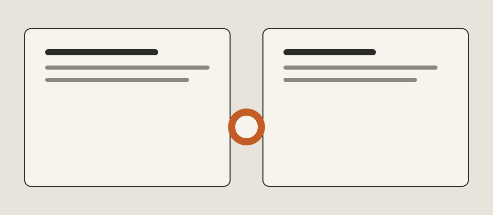

下午四点，窗外的雨从「该收衣服」变成「已经来不及」。我把中文稿写在左边，英文稿写在右边，中间只隔着一只杯子。

## 先写看见的东西

雨不是主题，是节拍。中文里我会先写「来不及」，英文里却会先写窗户为什么突然变亮——因为雨点把玻璃拍成了一面临时的灯。

同一只杯子，中文是「还温着」，英文是 `still warm enough to hold`。意思靠近，落点不同。

## 目录也该跟着换

如果切到另一种语言，标题、摘要、这一段，以及左边的目录，都应该换成那一桌的用词。URL 不必动。人还坐在原来的位置，只是换了一叠纸。

## 写完再喝一口

不必追求逐句对齐。能在两份草稿里认出同一场雨，就够了。
